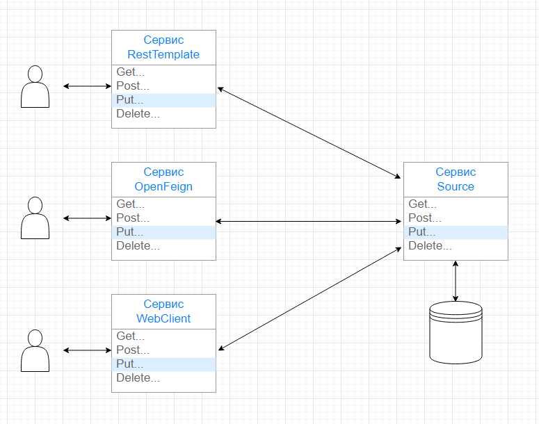

# synchronous-clients 
Этот проект написан для демонстрации способов синхронного взаимодействия сервисов в микросервисной архитектуре.
## Используемые технологии:

Перед запуском установите:
- Java 17
- Apache Maven 3.x

Общая схема взаимодействия осуществляется следующим образом:

С базой данных работает только сервис [Source](source), а остальные сервисы общаются с ним.

Сервисы названы по наименованию технологии, применяемой при организации взаимодействия.

Сервис [RestTemplate](resttemplate) использует технологию [RestTemplate](https://spring.io/guides/gs/consuming-rest/)

Сервис [OpenFeign](openfeign) использует технологию [OpenFeign](https://cloud.spring.io/spring-cloud-openfeign/reference/html/)

Сервис [WebClient](webclient) использует технологию [WebClient](https://spring.io/guides/gs/reactive-rest-service/) в синхронном варианте.

Сервисы запускаются на разных портах: 
- Source       - 8080
- RestTemplate - 8081
- OpenFeign    - 8082
- WebClient    - 8083

Для демонстрации работы склонируйте репозиторий, затем запустите общий для всех служб сервис [Source](source).\
Потом выберите сервис с интересующей технологией и запустите. Порядок запуска сервисов подробно описан в файлах ReadMe.md в каждом сервисе.

### Общий порядок работы:
Запускаем сервис Source, в браузере открываем интерфейс встроенной базы данных H2.

Подключаемся и смотрим, таблица пока пустая:

Затем запускаем любой сервис, например, RestTemplate. С помощью Postman

выполняем HTTP-запросы, получаем ответ

в консоли H2 контролируем результат.

Так же используем и другие сервисы.\
Более подробно порядок запуска описан в файлах ReadMe в соответствующих сервисах.
- Сервис [Source](source)
- Сервис [RestTemplate](resttemplate)
- Сервис [OpenFeign](openfeign)
- Сервис [WebClient](webclient)

