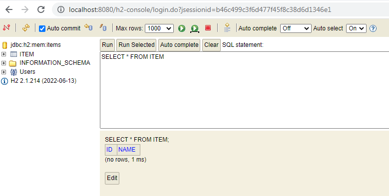
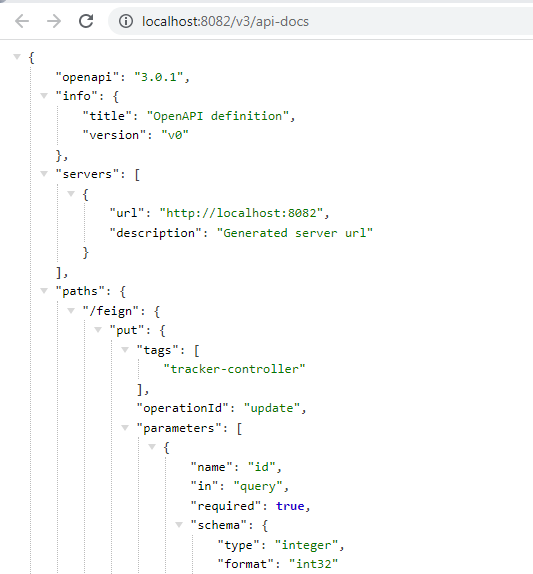
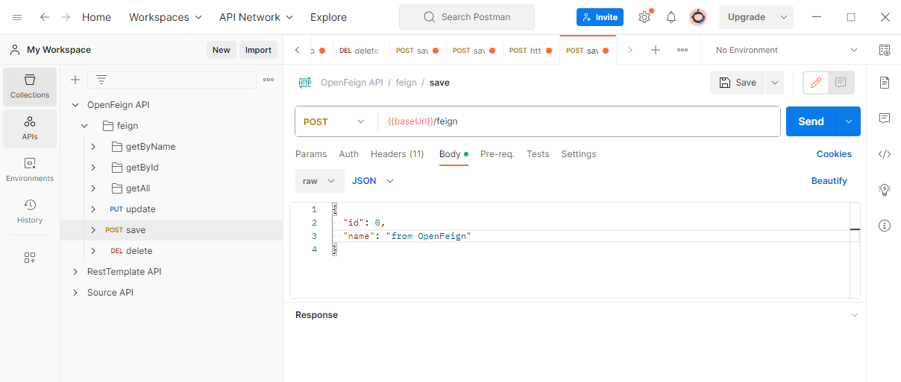
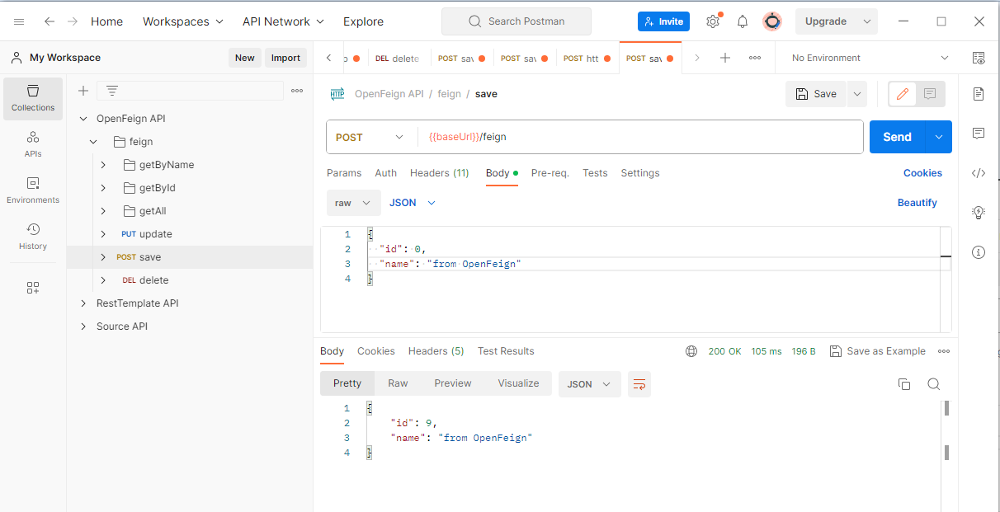

# Сервис OpenFeign

Этот сервис является частью проекта  [synchronous-clients](../)

## Запуск приложения

- Запуск приложения производится с использованием maven.
  Для перехода в каталог сервиса в командной строке выполните команду
```
    cd openfeign
```
- Затем выполните команды:
```
    mvn clean install
    mvn spring-boot:run
```
### Описание:

Сервис OpenFeign взаимодействует с сервисом [Source](../source). Сервис Source должен быть запущен.

Проверим это\


Сервис OpenFeign работает на порту 8082.

Для удобства работы к проекту подключен Swagger. Перейдите по адресу http://localhost:8082/swagger-ui/index.html


Затем перейдите по ссылке  /v3/api-docs



Скопируйте из адресной строки браузера ссылку http://localhost:8082/v3/api-docs

и импортируйте ее в Postman. Теперь можно выполнять запросы


и получать ответы в Postman


Контролируем изменения в базе данных


Таким образом, мы связали два сервиса, работающие на разных портах. Для демонстрации работы других сервисов перейдите по ссылкам:
- Сервис [RestTemplate](../resttemplate)
- Сервис [WebClient](../webclient) 

Связаться со мной можно по электронной почте a_esipov_it@list.ru
или в телеграм  @Alex46volokno

<div id="socials" align="center">
    <-- <a href="linkedin-url">
    
  </a> -->

  <a href="https://t.me/alex46volokno">
    
  </a>
</div>