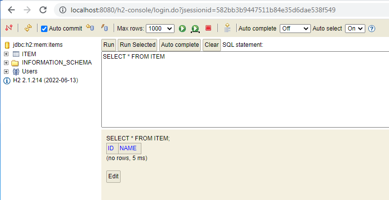
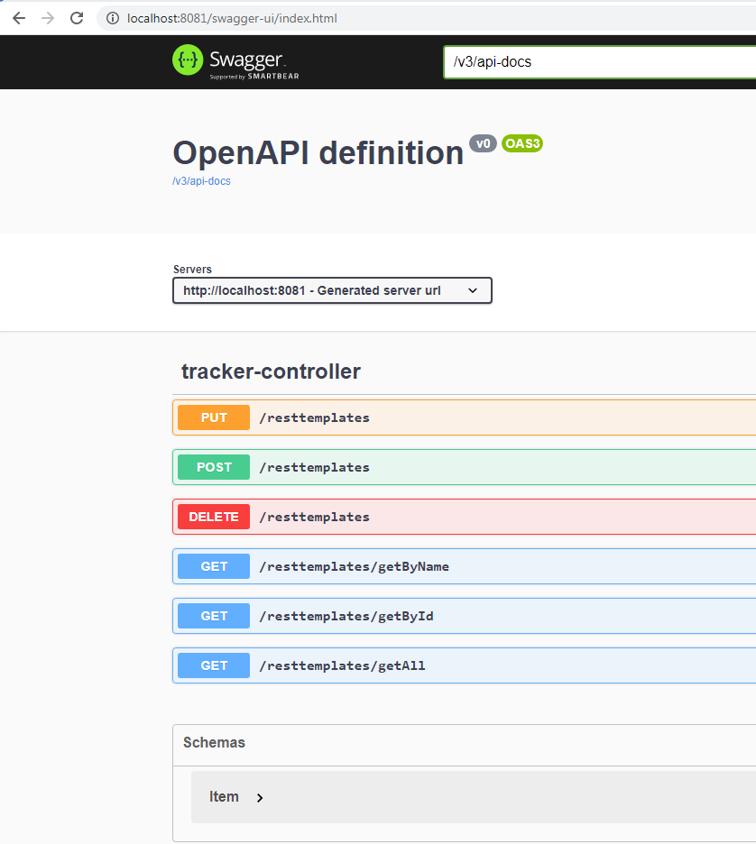
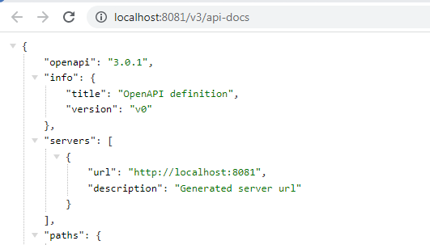
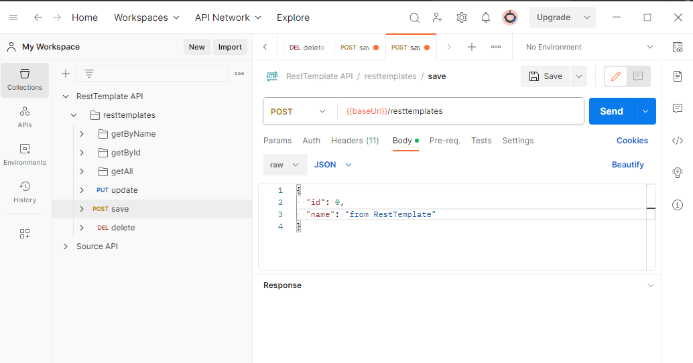
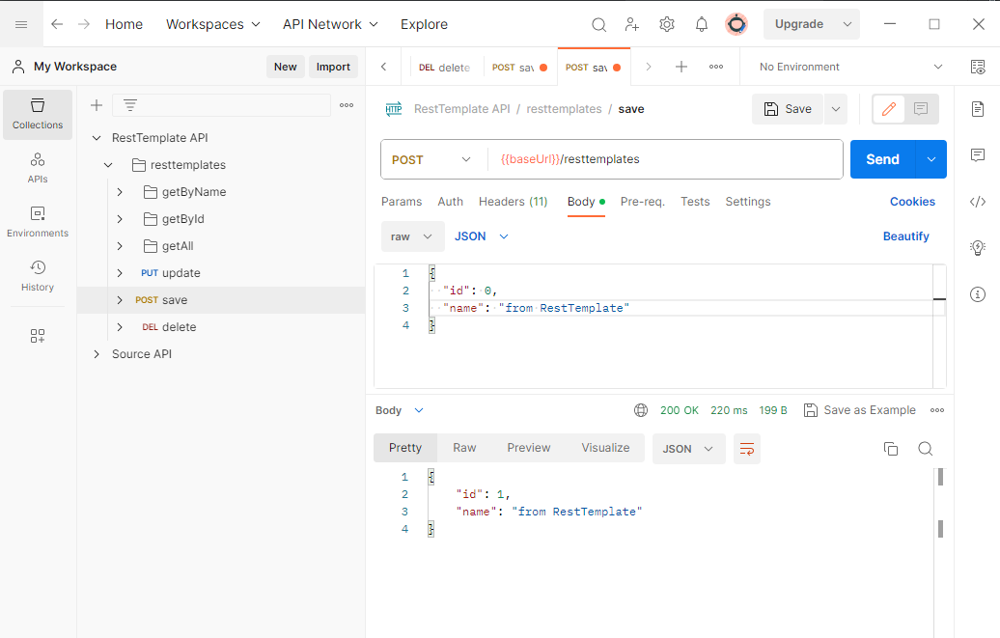
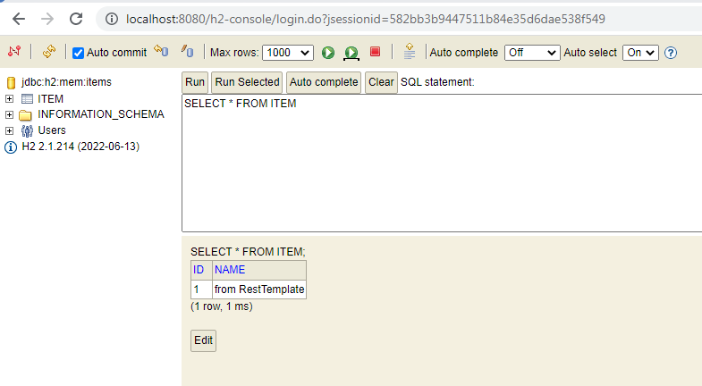

# Сервис RestTemplate

Этот сервис является частью проекта  [synchronous-clients](../)
## Запуск приложения

- Запуск приложения производится с использованием maven.
  Для перехода в каталог сервиса в командной строке выполните команду
```
    cd resttemplate
```
- Затем выполните команды:
```
    mvn clean install
    mvn spring-boot:run
```
### Описание:

Сервис RestTemplate взаимодействует с сервисом [Source](../source). Сервис Source должен быть запущен.

Проверим это\


Сервис RestTemplate работает на порту 8081.

Для удобства работы к проекту подключен Swagger. Перейдите по адресу http://localhost:8081/swagger-ui/index.html


Затем перейдите по ссылке  /v3/api-docs



Скопируйте из адресной строки браузера ссылку http://localhost:8081/v3/api-docs

и импортируйте ее в Postman. Теперь можно выполнять запросы


и получать ответы в Postman


Контролируем изменения в базе данных


Таким образом, мы связали два сервиса, работающие на разных портах. Для демонстрации работы других сервисов перейдите по ссылкам:
- Сервис [OpenFeign](../openfeign) 
- Сервис [WebClient](../webclient) 


