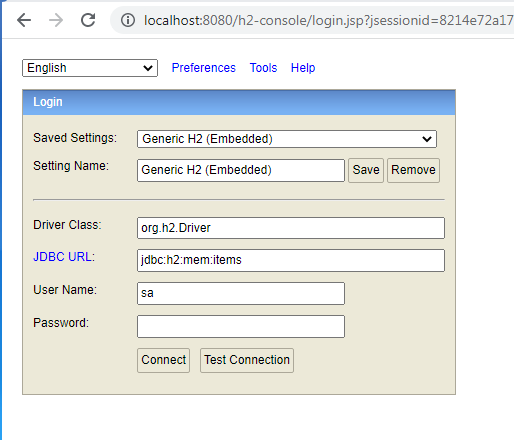
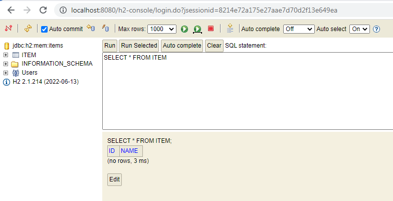
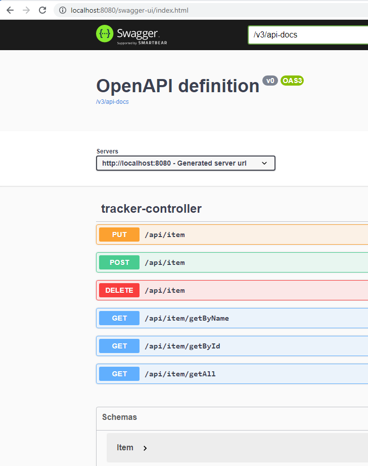
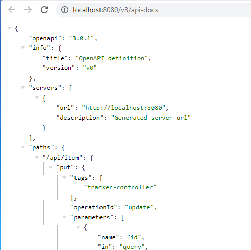
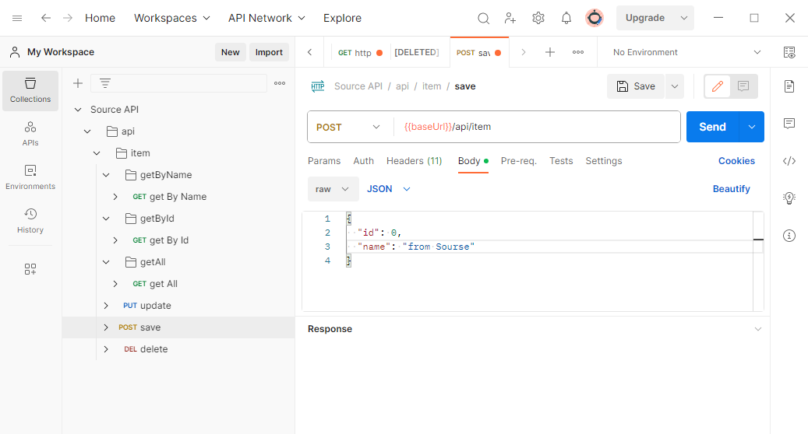
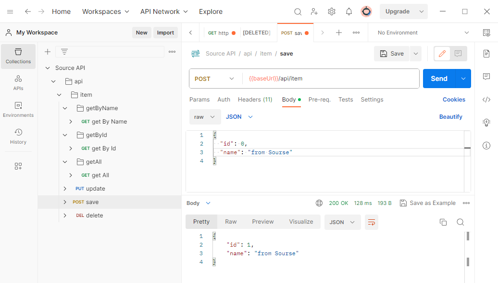
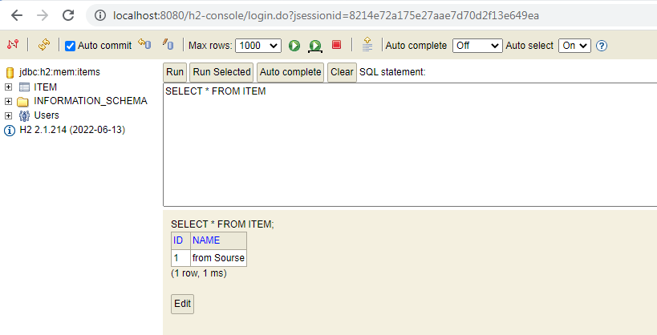

# Сервис Source

Этот сервис является частью проекта  [synchronous-clients](../)

Он работает с базой данных H2, размещенной в памяти

## Запуск приложения

- Запуск приложения производится с использованием maven.
   Перейдите в каталог сервиса и в командной строке выполните команду
```
    cd source
```
- Затем выполните команды:
```
    mvn clean install
    mvn spring-boot:run
```
### Описание:
После запуска сервиса перейдите в браузере по адресу http://localhost:8080/h2-console. Загрузится интерфейс базы данных H2\


Подключитесь и проверьте, что таблица пустая:


Для удобства работы к проекту подключен Swagger. Перейдите по адресу http://localhost:8080/swagger-ui/index.html


Затем перейдите по ссылке  /v3/api-docs



Скопируйте из адресной строки браузера ссылку http://localhost:8080/v3/api-docs 
и импортируйте ее в Postman. Теперь можно выполнять запросы


и получать ответы в Postman


Контролируем изменения в базе данных


Таким образом, сервис запущен и работает. Для обращения к нему через другие сервисы выберите и запустите нужный сервис 
- Сервис [RestTemplate](../resttemplate)
- Сервис [OpenFeign](../openfeign)
- Сервис [WebClient](../webclient)


